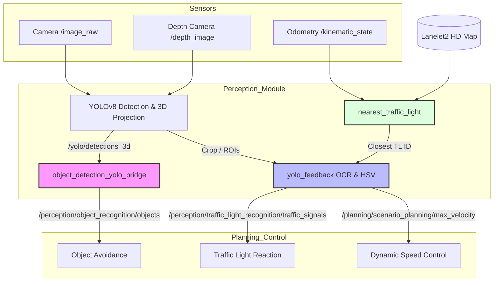

## 1. System Architecture & Launch Sequence

The `twizy_perception.launch.xml` acts as the primary entry point for the perception pipeline. It orchestrates the following components:

* **Direct Node Execution:** 
  * `object_detection_yolo_bridge`: Bridges external YOLO detections with Autoware-standard message formats.
* **Nested Launch Files (via `twizy_bringup.launch.py`):**
  * `detection.launch.xml`: Deploys YOLOv8 for 2D object detection, tracking, and 3D bounding box generation using depth data.
  * `yolo_feedback.launch.py`: Handles high-level semantic recognition (Traffic light colors and speed limit OCR).
  * `nearest_traffic_light.launch.xml`: Provides map-based context for traffic signal filtering.

---

## 2. Component Functional Breakdown

### A. Object Detection & 3D Transformation (YOLOv8 Suite)
Processes raw RGB images and depth information to identify obstacles, traffic lights, and speed signs. It transforms 2D pixels into 3D spatial coordinates.

### B. Message Format Bridging (`object_detection_yolo_bridge`)
Acts as the "translator" between the vision pipeline and the planning system.
* **Coordinate Transformation:** Converts detections from `base_link` (vehicle frame) to `map` (global frame) via TF.
* **Standardization:** Encapsulates raw data into `autoware_auto_perception_msgs/PredictedObjects`.
* **Trajectory Estimation:** Generates short-term motion predictions for detected objects.

### C. Map-based Context (`nearest_traffic_light`)
* **Map Parsing:** Reads `.osm` files (Lanelet2) to extract traffic light locations.
* **Proximity Filter:** Compares vehicle Odometry with map data to output the ID of the closest traffic light (within a 25-meter radius).

### D. Semantic Recognition (`yolo_feedback`)
* **Traffic Lights:** Combines the "Closest Light ID" with the YOLO bounding box. It uses **HSV color space masking** (Red/Yellow/Green) to determine the current signal state.
* **Speed Signs:** Extracts the region of interest (ROI) for speed limit signs and utilizes **OCR (pytesseract)** to read numeric values (e.g., 10, 20, 30 km/h).

---

## 3. Communication Interface (Topics)

| Node | Subscribed Topics | Published Topics |
| :--- | :--- | :--- |
| **object_detection_yolo_bridge** | `/yolo/detections_3d` | `/perception/object_recognition/objects` |
| **nearest_traffic_light** | `/localization/kinematic_state` | `/yolo_autoware_tools/closest_traffic_light_id` |
| **yolo_feedback** | 1. `/yolo/specific_image_detections` 2. `/yolo/spesific_detections_3d` 3. `/yolo_autoware_tools/closest_traffic_light_id` | 1. `/perception/traffic_light_recognition/traffic_signals` 2. `/planning/scenario_planning/max_velocity` |

> *Note: Low-level YOLOv8 nodes also subscribe to sensor-level topics like `/image_raw` and `/depth_image`.*

---

## 4. System Logic & Data Flow Diagram

The following diagram illustrates the relationship between sensors, perception nodes, and the downstream planning modules.

---

## 5. Downstream Impact (Business Logic)

Once the perception module publishes the processed information, the **Planning** and **Control** modules execute the following:

1.  **Dynamic Obstacle Avoidance:** Uses the 3D map-frame objects to decide whether to stop, slow down, or steer around pedestrians and vehicles.
2.  **Traffic Signal Compliance:** By mapping the vision-detected color to a specific HD Map ID, the vehicle knows exactly which stop line it must respect, enabling precise braking at intersections.
3.  **Adaptive Speed Regulation:** The system "reads" road signs. If a 15 km/h sign is detected, the OCR output overrides the default global speed limit, ensuring the vehicle operates safely according to local regulations.

***

*(注：如果你的环境由于某些原因完全不支持 Mermaid，你也可以打开网页版的 [Mermaid Live Editor](https://mermaid.live/)，将上面的 `mermaid` 代码块内容粘贴进去，就能直接生成并导出流程图的图片了。)*