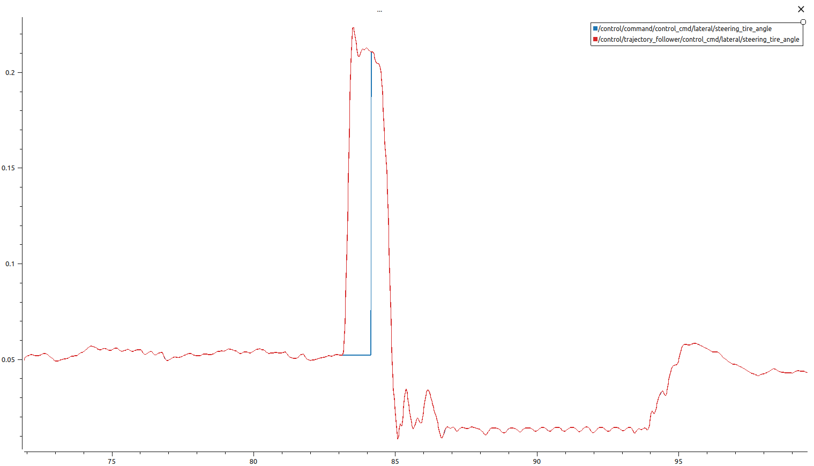

# autonomous_emergency_brake_handler
This package is responsible for handling Autonomous Emergency Braking (AEB) events by monitoring diagnostic messages, managing vehicle engagement, and issuing emergency control commands when necessary.

## config
- **autonomous_emergency_brake_handler.param.yaml:** Contains the speed and jerk parameters to be applied when the AEB event occurs.

## src
- **autonomous_emergency_brake_handler.cpp:** This script mainly responsible for two things.
    1. **Emergency Control Command Publishing:** Automatically publishes an emergency control command when an AEB event occurs, stopping the vehicle.
        
    2. **Engagement Management:** Sets the vehicle’s engage status to false, stopping all movement. The vehicle remains stationary until engage is manually set to true by the user.

## launch
- **autonomous_emergency_brake_handler.launch.xml:** Includes launch file that start the main system

## USAGE
1. Run the below command.

     ```ros2 launch  autonomous_emergency_brake_handler autonomous_emergency_brake_handler.launch.xml``

## TODO
- Keeps the steering_tire_angle value at its current value when the emergency brake is active. When object_stop or autonomous emergency brake is triggered, a sudden increase occurs in steering_tire_angle. After correcting this, the effect of emergency braking on steering_angle_rate should be observed. 